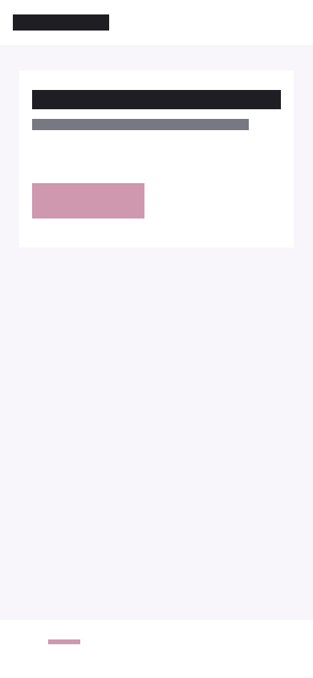
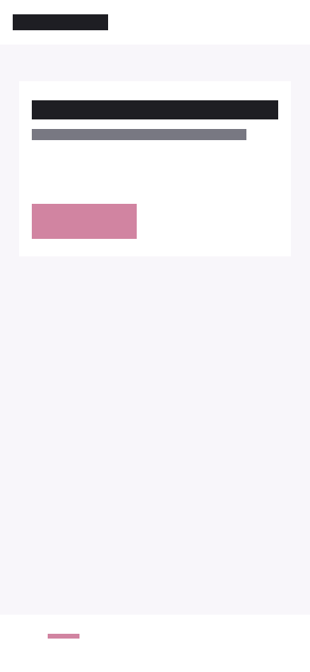

# StitchGuard

AI frontend agents are fast.  
But they often ignore the design.

StitchGuard compares your target design screenshot with your implemented UI and generates a precise repair report for Codex, Cursor, Claude Code, and other AI coding agents.

**StitchGuard does not just show a pixel diff — it turns visual mismatch into a repair prompt your coding agent can act on.**

**Live demo:** [stormbold.github.io/StitchGuard](https://stormbold.github.io/StitchGuard/) — try the sample, copy the repair prompt, no install.

> **Disclaimer:** StitchGuard is not affiliated with Google, OpenAI, Anthropic, Cursor, or any design-to-code platform.

## Demo


Open the [live demo](https://stormbold.github.io/StitchGuard/) → **Try Google Stitch → Codex sample** → Compare → situation-specific **Codex Fix Prompt** (copy or download).  
Animated GIF: tracked in [good first issues](docs/good-first-issues.md).

## Why StitchGuard?

Visual regression tools tell you that pixels changed.  
**StitchGuard tells your coding agent what to fix.**

Read [docs/why-stitchguard.md](docs/why-stitchguard.md) for the full positioning vs Playwright / Pixelmatch.

### Flagship example: Google Stitch → Codex

| Target design | Codex implementation |
|---------------|---------------------|
|  |  |

Pre-generated report: [examples/google-stitch-to-codex/report.md](examples/google-stitch-to-codex/report.md)  
Repair prompt: [examples/google-stitch-to-codex/codex-fix-prompt.md](examples/google-stitch-to-codex/codex-fix-prompt.md)

**Flow:** Target Design → AI Implementation → Visual Diff → Codex Fix Prompt

---

## Getting started

### Requirements

- Node.js 20+
- [pnpm](https://pnpm.io/) 9+

### Install from source

There is no npm package yet — clone and build:

```bash
git clone https://github.com/Stormbold/StitchGuard.git
cd StitchGuard
pnpm install
pnpm build
pnpm generate-examples
```

Then run:

```bash
pnpm stitchguard compare examples/screenshots/target.png examples/screenshots/actual.png
```

Open `.stitchguard/report.md` and `.stitchguard/codex-fix-prompt.md`.

Planned: `npx stitchguard compare …` after npm publish — see [docs/npm-publishing.md](docs/npm-publishing.md).

### Browser setup (for `check --url`)

```bash
pnpm setup:browser
```

### Web demo (no install)

**Online:** [https://stormbold.github.io/StitchGuard/](https://stormbold.github.io/StitchGuard/)

**Local:** `pnpm demo:web`

---

## User guide

### Compare two screenshots

```bash
pnpm stitchguard compare ./design.png ./actual.png
```

| Flag | Description |
|------|-------------|
| `--threshold 0.92` | Fail if match is below 92% |
| `--agent codex` | Write codex/cursor/claude prompts |
| `--tailwind` | Include inspect-oriented Tailwind hints |
| `-o .stitchguard` | Custom output directory |

### Check a running app

```bash
pnpm stitchguard check \
  --target ./design/mobile-home.png \
  --url http://localhost:3000 \
  --viewport 390x844
```

### Agent repair loop

1. Run StitchGuard (compare or check)
2. Open `.stitchguard/codex-fix-prompt.md`
3. Paste into your coding agent
4. Re-run until the score improves

### Init agent rules in your project

```bash
pnpm stitchguard init-agent
```

---

## GitHub Actions

Requires tag [`v1`](https://github.com/Stormbold/StitchGuard/releases):

```yaml
- uses: Stormbold/StitchGuard/action@v1
  with:
    target: ./design/home.png
    actual: ./screenshots/actual.png
    threshold: "0.90"
    comment-on-pr: "true"
    upload-artifacts: "true"
```

See [docs/github-actions.md](docs/github-actions.md).

---

## MCP Server

```bash
node packages/mcp-server/dist/index.js
```

See [docs/mcp-setup.md](docs/mcp-setup.md).

---

## Development

```bash
pnpm install
pnpm build
pnpm test
pnpm lint
pnpm build:action
pnpm generate-all
```

---

## Documentation

- [Why StitchGuard?](docs/why-stitchguard.md)
- [Getting started](docs/getting-started.md)
- [Examples gallery](examples/README.md)
- [GitHub Actions](docs/github-actions.md)
- [MCP setup](docs/mcp-setup.md)
- [npm publishing plan](docs/npm-publishing.md)
- [GitHub About setup](docs/github-about.md)
- [Roadmap](docs/roadmap.md)
- [Good first issues](docs/good-first-issues.md)

## License

MIT — see [LICENSE](LICENSE).
